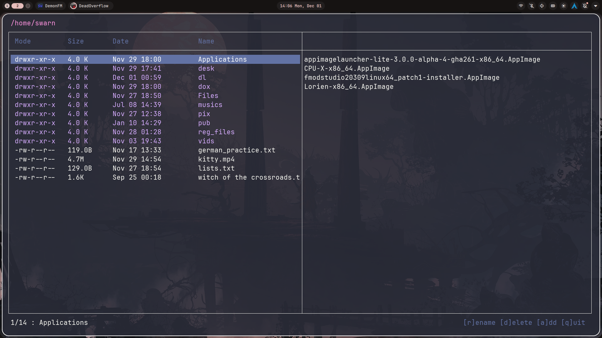

# DemonFM

A Simple TUI FileManager

# Keybinds

- Navigation -> vim keybinds / arrow keys
- Show/Hide dotfiles -> .
- Rename a file / directory -> r
- Delete a file / directory -> d
- Add a file / directory -> a
- Yank a file / directory -> y
- Paste a file / directory -> p
- cut a file / directory -> x
- select multiple files / directories -> space
